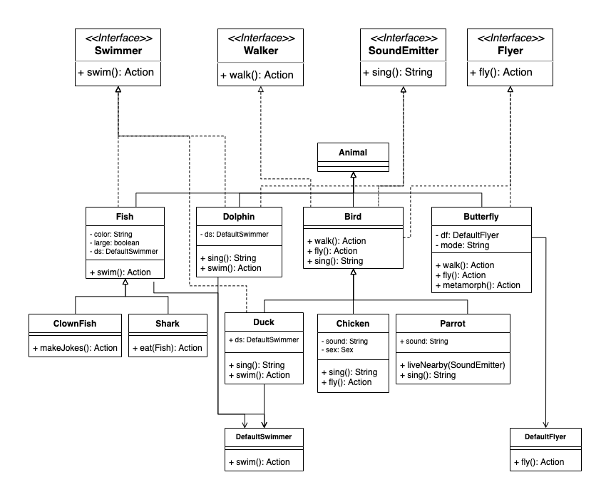

# Java Class Composition and Inheritance
---




# A. Basic

### A.1. Method `sing()` Implementation of class Bird

#### a. Unit Test

* Change return value of method `sing()` from void to String.
* Use this string as parameter for method `assertEquals`
* Using JUnit 5
* See [Bird.java](src/main/java/org/muntasir/zoolab/animal/Bird.java)
* See [BirdTest.java](src/test/java/org/muntasir/zoolab/animal/BirdTest.java)


#### b. Code Maintainability

* By writing comment\
    e.g. enum `Action` has documentation as comment.
* By Separating concern by separating classes into different packages.
* By coupling architecture component separately, using various design patterns, e.g. Strategy design pattern. 

### A.2. Duck and Chicken

Chicken inability to fly is implemented by throwing `ActionException` inside method `fly()`.
```$java
public Action fly() throws ActionException {
    throw new ActionExection(Action.FLY, "My wings are clipped");
}
```

* See [Duck.java](src/main/java/org/muntasir/zoolab/animal/Duck.java) 
* See [Chicken.java](src/main/java/org/muntasir/zoolab/animal/Chicken.java)

### A.3. Rooster

* Initially Rooster is implemented as Chicken instance who has different states.
* At constructor method, the caller passes a boolean parameter to determine the new `Chicken` instance as rooster or as hen. 
* Based on parameter value, the member variable sound is adjusted accordingly.
* See [Chicken.java](src/main/java/org/muntasir/zoolab/animal/Chicken.java) 

### A.4. Parrot

* class Parrot has method `liveNearby` that accept `SoundEmitter` instance as parameter
* interface `SoundEmitter` define method `sing()` that return String.
* class Parrot use that value as its own sound for method `sing()`
* Any other object that implements interface `SoundEmitter` can be used as basis of class Parrot `sing()` 
* See [Parrot.java](src/main/java/org/muntasir/zoolab/animal/Parrot.java) and [ParrotTest.java](src/test/java/org/muntasir/zoolab/animal/ParrotTest.java) as illustration of above explanation.
    
# B. Fish Implementation

### B.1. Can't sing, Can't walk, but It Can Swim.

* Initially those are implemented as ActionException
* Later, after refactoring, method sing() and method walk() are removed from class Fish
* The walking and singing capability are determined by implementation of interface Walker and interface SoundEmitter. 

### B.2. Shark and ClownFish


* See [Shark.java](src/main/java/org/muntasir/zoolab/animal/Shark.java) 
* See [ClownFish.java](src/main/java/org/muntasir/zoolab/animal/ClownFish.java)


### B.3. Dolphin

* class `Dolphin` implements interface `Swimmer` without extending class `Fish`
* To minimize code duplication, the actual method `swim()` is implemented by class `DefaultSwimmer`.
* class `DefaultSwimmer` is instantiated inside method constructor of class Dolphin, Fish, Duck, Shark, ClownFish. 
* See [Dolphin.java](src/main/java/org/muntasir/zoolab/animal/Dolphin.java)

# D. Animal that change over time (Butterfly)

### D.1. Butterfly can fly, but it doesn't make sound

* See [Butterfly.java](src/main/java/org/muntasir/zoolab/animal/Butterfly.java)

### D.2. Caterpillar metamorphose to Butterfly

* The caterpillar mode is modeled as group state of member variable of class Butterfly.
* The detail of method `fly()` is delegated class DefaultFlyer.
* An instance of class DefaultFlyer is created, after method `metamorphose()` is invoked.  
* See [Butterfly.java](src/main/java/org/muntasir/zoolab/animal/Butterfly.java) and [ButterflyTest.java](src/test/java/org/muntasir/zoolab/animal/ButterflyTest.java)

# E. Animal Capability Counter

See [AnimalCounter.java](src/main/java/org/muntasir/zoolab/main/AnimalCounter.java)

|*Capability*|*Count*|*Animals*|
|------------|------:|---------|
| Fly  |4 | Bird, Duck, Parrot, Butterfly |
| Walk |9 | Bird, Duck, Chicken, Rooster, Parrot, Frog, Dog, Butterfly, Cat|
| Sing |9 | Bird, Duck, Chicken, Rooster, Parrot, Dolphin, Frog, Dog, Cat |
| Swim |5 | Duck, Fish, Shark, ClownFish, Dolphin|

# BONUS

### Bonus.1 Second Language

* Add 2 additional languages: Germany and Indonesia
* See [LanguageDemo.java](src/main/java/org/muntasir/zoolab/main/LanguageDemo.java)
* See [Rooster.java](src/main/java/org/muntasir/zoolab/animal/Rooster.java) and [Animal.java](src/main/java/org/muntasir/zoolab/animal/Animal.java) 
* Output: kikeriki (DE), Kukuruyuk (ID)


